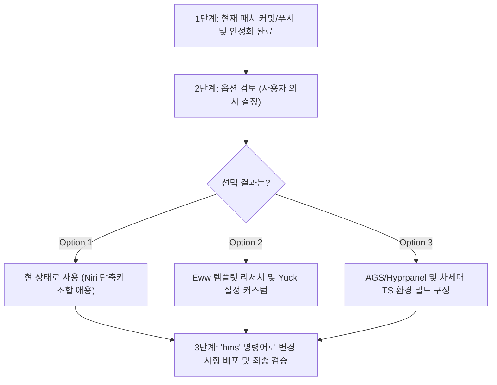

# 📋 [TODO] Desktop Shell 개선 및 전환 옵션 비교 검토

현재 `galaxy-book` 호스트를 비롯한 Niri 컴포지터 데스크탑 환경 하에서 **Noctalia v5.0.0(알림 및 제어 센터)의 키보드 조작 및 접근성 한계**를 해결하기 위한 개선/전환 옵션 검토 문서입니다. 

이 문서를 바탕으로 추후 사용자의 검토를 거쳐 최종 도입 방향을 결정합니다.

---

## 🔍 배경 (Context)
*   **이슈 발생**: `Mod+N` 단축키를 통해 Noctalia의 제어 센터를 띄웠을 때, 마우스/터치패드 외에 키보드 화살표 및 Tab 키를 이용한 내부 요소 이동/선택이 불가능함.
*   **원인 규명**: 
    1. Noctalia v5.0.0은 기존의 Qt6/Quickshell을 걷어내고 **C++ 및 순수 OpenGL 자체 엔진**으로 재작성되었으나, 알파 단계의 릴리즈 상태로 인해 위젯 내부의 키보드 초점(a11y focus) 조작 기능이 아직 미구현 상태임.
    2. 추가로 NixOS 세션에 정의된 `QT_IM_MODULE=fcitx` 환경 변수로 인해, 메뉴가 열린 상태에서 컴포지터(Niri) 단축키(`Mod+N`)마저 먹통이 되어 제어 센터가 닫히지 않는 락업 현상도 확인됨.
*   **임시 조치 완료**:
    - [modules/services/noctalia.nix](file:///home/yongminari/nixos-home-manager/modules/services/noctalia.nix)에 `QT_IM_MODULE=""` 환경 변수 무시 처리를 영구 적용하여, 메뉴 오픈 시에도 컴포지터 단축키를 통한 온/오프 및 종료가 원활히 작동하도록 수선함.
    - [modules/desktop/niri/config.kdl](file:///home/yongminari/nixos-home-manager/modules/desktop/niri/config.kdl)의 레거시 `noctalia-overview` 레이어 규칙을 v5 프리셋에 호환되도록 `noctalia-(wallpaper|backdrop)`으로 패치함.

---

## 🛠️ 데스크탑 쉘 개선 및 전환을 위한 3가지 옵션

### 1️⃣ Option 1: Noctalia 최적화 유지 (현 상태 유지)
Noctalia v5.0.0의 경량화된 C++ 성능을 그대로 누리되, 제어 센터 조작은 마우스/터치패드로 양보하고 시스템 제어(볼륨, 밝기 등)는 Niri의 네이티브 단축키를 주력으로 활용하는 타협안입니다.

*   **주요 특징**:
    - 추가적인 리소스 소모 및 복잡한 설정 전면 방지.
    - `Mod+Space`(앱 런처)는 정상적으로 키보드 타이핑, 이동, 실행이 모두 완벽히 연동됨.
*   **👍 장점**:
    - 별도의 설정 패치나 개발 리소스 투입이 필요 없음 (안정성 최상).
    - C++ 자체 엔진 기반이라 RAM 점유율이 극도로 낮음 (~100MB 수준).
*   **👎 단점**:
    - 제어 센터(`Mod+N`) 안의 세부 항목들은 여전히 키보드로 조작할 수 없음.
*   **📝 세부 조치 사항**:
    - 이미 동의 하에 `QT_IM_MODULE` 제거 패치가 가동 중이므로 추가 변경 불필요.

---

### 2️⃣ Option 2: Eww (Elkowars Wacky Widgets) 도입 및 템플릿 이식
리눅스 커스텀 씬의 전설적인 위젯 엔진인 **Eww (Rust 기반)**를 도입하여, 바(Bar)와 제어 센터를 완전히 독자적인 위젯으로 구현하는 옵션입니다.

*   **주요 특징**:
    - GTK3 기반 위에 빌드되므로, 위젯 내 키보드 포커스(Tab, Arrow) 및 휠 제어가 완벽히 동작함.
    - `Yuck`(Lisp 계열 마크업) 언어와 CSS/SCSS를 결합하여 설계함.
*   **👍 장점**:
    - **키보드 접근성 완벽 지원**: 방향키와 Tab 키를 통해 위젯 내의 모든 단추와 슬라이더 제어 가능.
    - 전 세계 유저들이 디자인해 둔 초고품질의 완성형 템플릿(macOS, iOS, Android 등)이 풍부함.
*   - Rust 컴파일 기반이라 가볍고 네이티브한 동작 속도 보장.
*   **👎 단점**:
    - 상태 바, 런처, 알림 제어 센터를 각각 조각조각 구현하거나 다른 사람의 템플릿 코드를 긁어와 이식해야 하는 손이 많이 가는 작업(Integration) 필요.
*   **📝 도입 시 TODO**:
    1. `home.packages`에 `eww` 추가.
    2. GitHub에서 선호하는 완성형 Eww 디자인 테마 확보 및 `~/.config/eww/`에 이식.
    3. 볼륨, 블루투스, Wi-Fi 등 우리 시스템 드라이버 노드 경로에 맞춰 Yuck 변수 바인딩 수선.

---

### 3️⃣ Option 3: AGS (Aylur's GTK Shell) 및 차세대 TS 쉘 도입
현재 Wayland 생태계에서 가장 진보한 위젯 및 데스크탑 쉘 프레임워크인 **AGS (TypeScript 기반)**를 적용하는 방안입니다.

*   **주요 특징**:
    - GTK3/GTK4 기반 위에 동작하며, GJS(GObject JavaScript)를 백엔드로 사용.
    - **TypeScript / JavaScript**를 이용하여 전체 데스크탑 쉘과 애니메이션을 고도로 선언형으로 조작.
*   **👍 장점**:
    - 극적인 스마트폰 수준의 가속 애니메이션 및 미려한 블러 효과.
    - 키보드 제어 및 OS 접근성 프로토콜 완벽 지원.
    - **Hyprpanel**과 같이 완성도가 뛰어난 AGS 기반의 완성형 제어 센터 패키지가 존재함.
*   **👎 단점**:
    - 구동 시 NodeJS/GJS 런타임이 올라가므로 Noctalia/Eww에 비해 약간의 리소스(RAM 등) 소모가 더 있음.
    - 자작 시 JS/TS 코딩 지식이 대폭 필요함.
*   **📝 도입 시 TODO**:
    1. Home Manager에 `inputs.ags.homeManagerModules.default` 등 AGS 입력 정의 및 패키지 주입.
    2. 완성도 높은 TypeScript 기반 패키지 쉘 구성 요소 확보 및 빌드 테스트.

---

## 📊 옵션 간 종합 비교 요약

| 항목 | Option 1 (Noctalia 유지) | Option 2 (Eww 도입) 🦀 | Option 3 (AGS 도입) ⚡ |
| :--- | :--- | :--- | :--- |
| **키보드 내비게이션** | ❌ 불가 (마우스 전용) | 🟢 **완벽 지원** | 🟢 **완벽 지원** |
| **커스텀 디자인 자유도** | 🟡 보통 (정해진 레이아웃) | 🟢 **최상 (무한 자유도)** | 🟢 **최상 (고급 애니메이션)** |
| **리소스 최적화 (RAM)** | 🟢 우수 (~100MB) | 🟢 우수 (~120MB) | 🟡 보통 (~250MB+) |
| **도입 및 관리 난이도** | 🟢 **최하 (추가 작업 없음)** | 🔴 높음 (코드 이식 필요) | 🔴 높음 (TS 아키텍처 학습 필요) |
| **추천 대상** | 설정 최소화 및 편의성을 중시하는 유저 | 마우스 없이 순수 키보드로 고도로 제어하려는 유저 | 화려한 맥북/스마트폰 스타일 비주얼을 원하는 유저 |

---

## 📅 향후 이행 계획 (Roadmap)

위의 3가지 전환 설계안을 검토해 보신 후, 향후 적용 방향을 결정해 주시면 그에 맞춰 최적의 Nix 설정을 정밀 설계하겠습니다!
